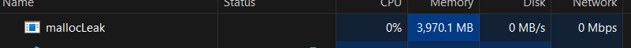

# Eksplorasi Memory Leak dalam Aplikasi dengan malloc

## Identitas
- **Nama:** Luthfi Satrio Wicaksono
- **NIM:** 231524049

## Hasil Eksperimen

Pada eksperimen ini, dilakukan eksplorasi terkait potensi terjadinya **memory leak** dalam aplikasi yang menggunakan `malloc` untuk alokasi memori. Eksperimen ini menunjukkan bahwa aplikasi terus menggunakan memori secara berlebihan saat berjalan, meskipun memori tersebut tidak lagi dibutuhkan.

### Observasi

- Setelah beberapa kali penggunaan `malloc`, aplikasi menunjukkan peningkatan penggunaan memori yang terus-menerus.
- Meskipun alokasi memori sudah tidak diperlukan, memori tidak dikembalikan ke sistem, mengindikasikan terjadinya memory leak.
- Aplikasi terus mempertahankan memori yang sudah tidak diperlukan, yang dapat menyebabkan masalah serius dalam jangka panjang, seperti kehabisan memori atau penurunan performa.

### Kesimpulan

Eksperimen ini menggarisbawahi pentingnya mengelola memori dengan benar dalam aplikasi, khususnya dengan memastikan bahwa setiap blok memori yang dialokasikan dengan `malloc` harus dilepaskan dengan `free` setelah tidak lagi dibutuhkan. Tanpa manajemen memori yang baik, aplikasi dapat mengalami memory leak, yang berpotensi menyebabkan gangguan operasi dan menurunkan efisiensi sistem.
